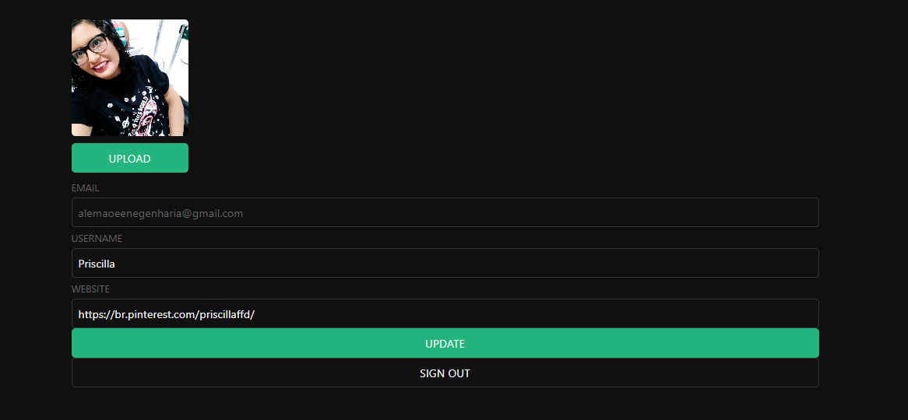
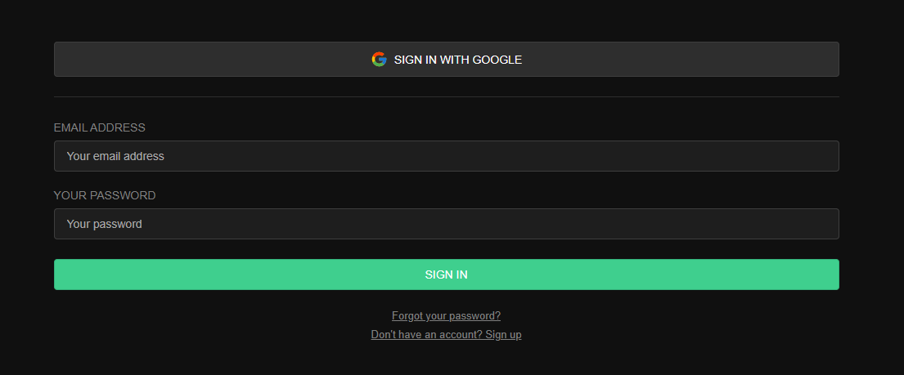

# User Management App with Next.js

Project Tutorial based on Supabase Documentation
https://supabase.com/docs/guides/getting-started/tutorials/with-nextjs

# About the Project

        -Authenticates and identifies the user

        - Stores their profile information in the database

        -Allows the user to Log in

        -Update their profile details

        -Upload the profile photo

## Layout web

Profile Update Page

Login In Page

# Tecnologies used

## Back end

    app.supabase.com: hosted Postgres database with restful API for usage with Supabase.js

## Front end

        Next.js - React framework for production
        Supabase.js - for user management and realtime data syncing.
        Supabase Auth Helpers for Next.js
        Supabase pre-built Auth UI React.

# Autor

Priscilla Falcão
